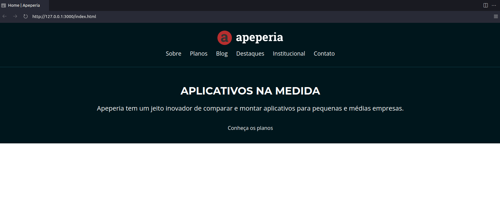
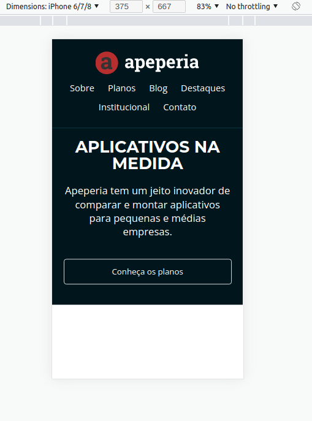
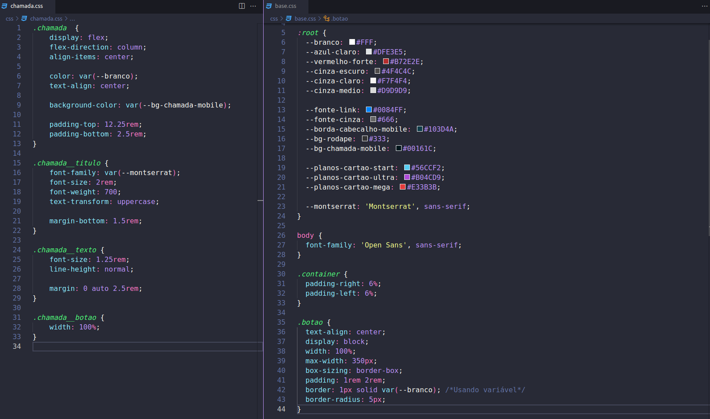

# projeto-apeperia
Arquivos do projeto para a Apeperia

Faça esse curso de HTML e CSS e:

- Entenda o processo de desenvolvimento de páginas web.

- Conheça o Emmet, ferramenta para agilizar a escrita de códigos.

- Melhore a manutenção de códigos com variáveis CSS.

- Escreva códigos semânticos que ajudam na acessibilidade e SEO.

- Aprenda a lidar com adaptação de diferentes layouts.

- Aprimore seu conhecimento de responsividade.

**INSTRUTOR:** Matheus Alberto

GitHub Pages: [Acessem](https://tiagomerc.github.io/Layouts-Responsivos-trabalhando-com-layouts-mobile/)

### 01. Ferramentas, unidades e imagens

Nessa aula, aprendemos:

- Analisar e desmembrar o layout recebido;

- Usar o EMMET para criar blocos de código HTML;

- Usar as unidades relativas REM e EM;

- Tipos de imagens e SVGs;

**cabeçalho e chamada**

### 02. Layout mobile e variáveis CSS

Nessa aula, aprendemos:

- O que é e para que serve mobile-first;

- Como funciona o **initial-scale** dentro do conteúdo do Viewport;

- Como declarar e chamar variáveis CSS;

**Layout Mobile**

**Variáveis CSS**

