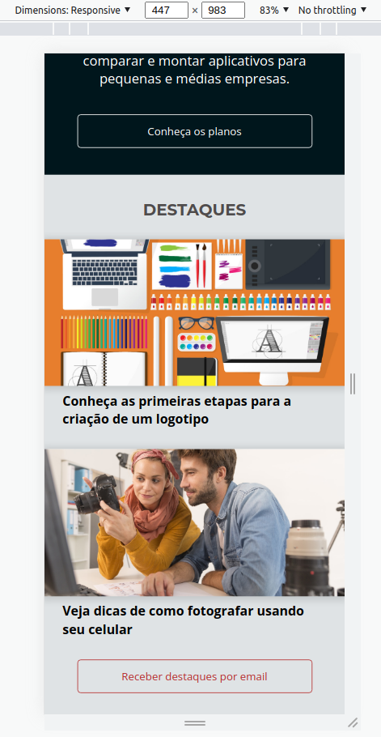
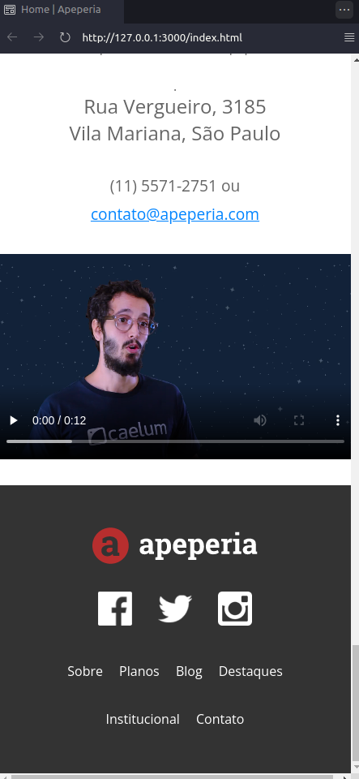
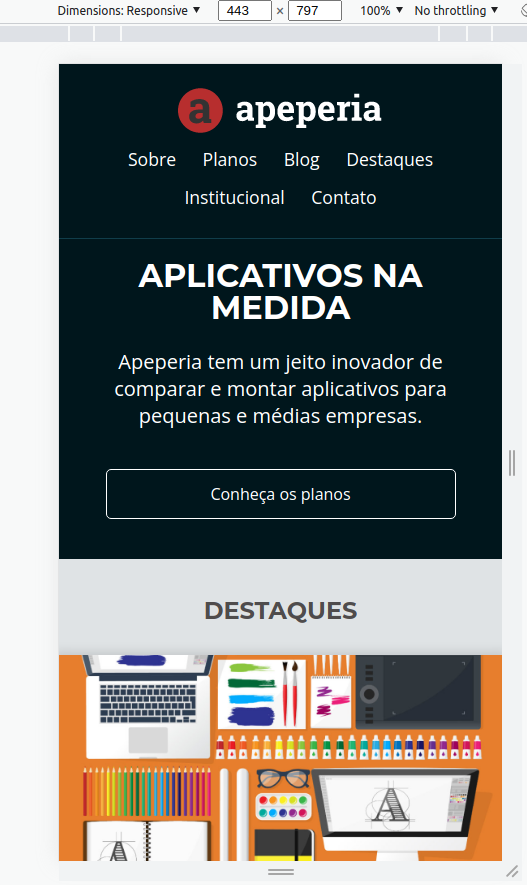
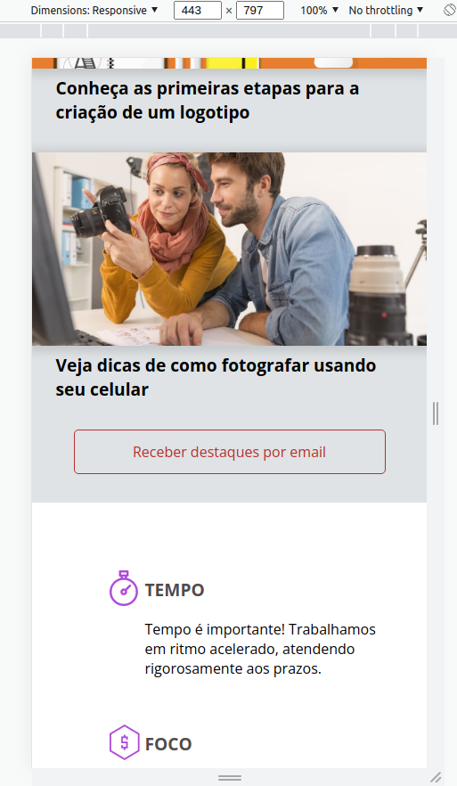
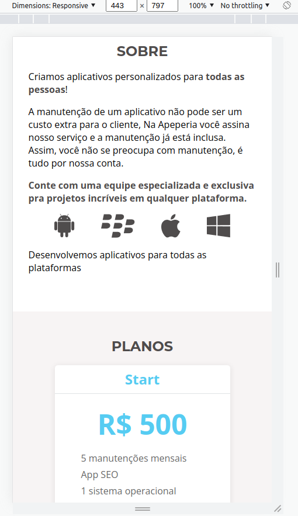
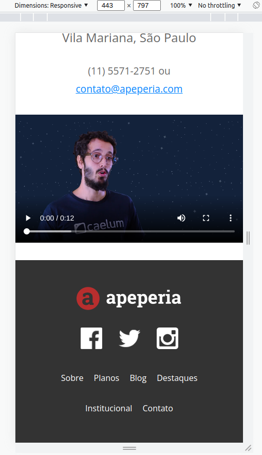
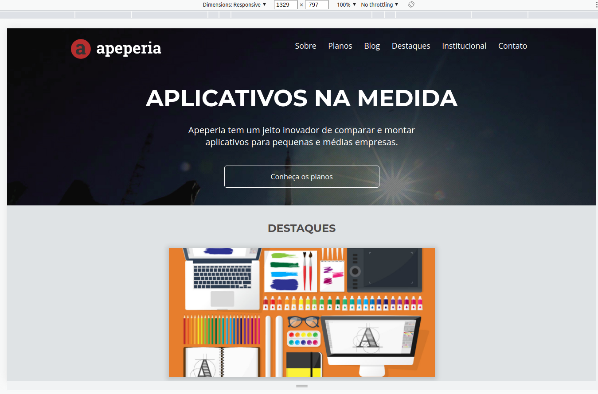
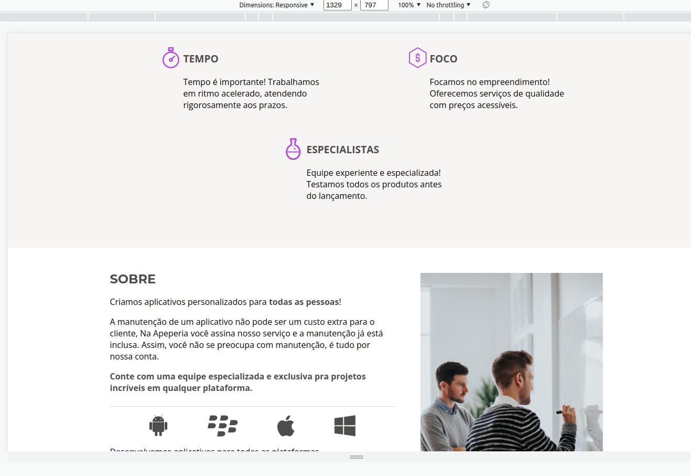
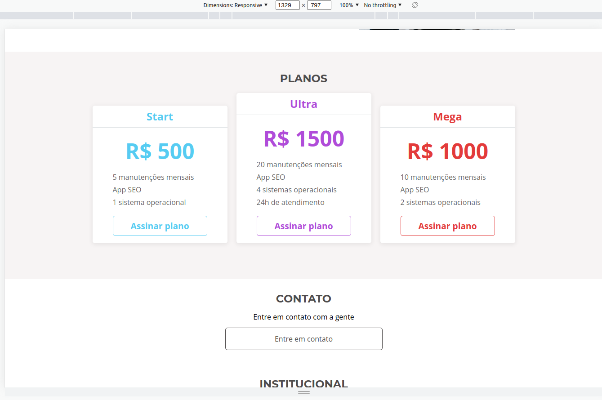
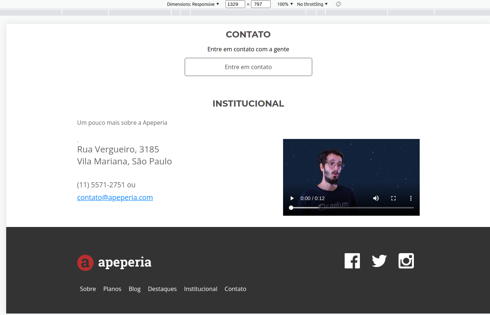

# projeto-apeperia
Arquivos do projeto para a Apeperia

Faça esse curso de HTML e CSS e:

- Entenda o processo de desenvolvimento de páginas web.

- Conheça o Emmet, ferramenta para agilizar a escrita de códigos.

- Melhore a manutenção de códigos com variáveis CSS.

- Escreva códigos semânticos que ajudam na acessibilidade e SEO.

- Aprenda a lidar com adaptação de diferentes layouts.

- Aprimore seu conhecimento de responsividade.

**INSTRUTOR:** Matheus Alberto

GitHub Pages: [Acessem](https://tiagomerc.github.io/Layouts-Responsivos-trabalhando-com-layouts-mobile/)

### 01. Ferramentas, unidades e imagens

Nessa aula, aprendemos:

- Analisar e desmembrar o layout recebido;

- Usar o EMMET para criar blocos de código HTML;

- Usar as unidades relativas REM e EM;

- Tipos de imagens e SVGs;

**cabeçalho e chamada**

### 02. Layout mobile e variáveis CSS

Nessa aula, aprendemos:

- O que é e para que serve mobile-first;

- Como funciona o **initial-scale** dentro do conteúdo do Viewport;

- Como declarar e chamar variáveis CSS;

**Layout Mobile**

**Variáveis CSS**

### 03. Particularidade de telas

Nessa aula, aprendemos:

- Utilizar as unidades de viewport;

- Identificar a diferença entre unidades absolutas e relativas;

- Analisar as limitações físicas de dispositivos;

**Particularidade de telas**

### 04. Trabalhando a semântica HTML

Nessa aula, aprendemos:

- Como lidar com as imagens do layout que recebemos;

- Tags e atributos que têm mais função de semântica do que estilo;

- A importância de escrever um código semântico;

**Tags address, video e br**

**Atributo title**

### 05. Evoluindo do mobile ao desktop 

Nessa aula, aprendemos:

- Criar estilizações diferentes para diversos dispositivos com media queries;

- Adaptar estrutura e conteúdo para layouts diferentes;

- Progredir de um layout mobile até um layout para desktop;

**Mobile**

- Mobile cabeçalho

- Mobile Diferencial

- Mobile Sobre e planos 

- Mobile Contato e Institucional

- Mobile Rodape

**Desktop**

- Desktop cabeçalho

- Desktop diferenciais e sobre 

- Desktop planos

- Desktop contato e rodape

